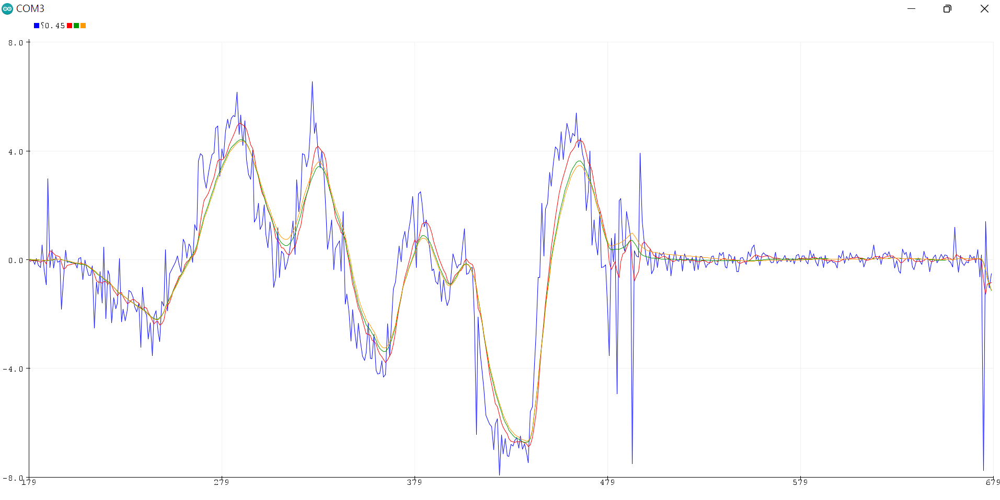
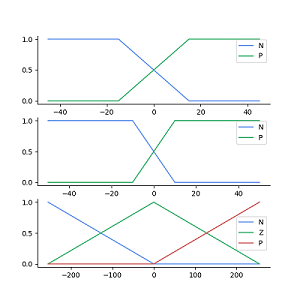
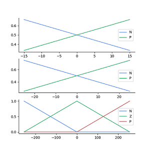
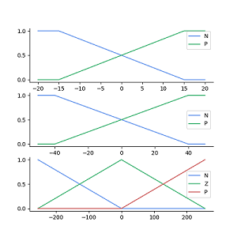
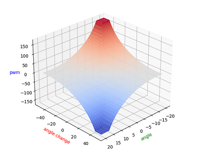
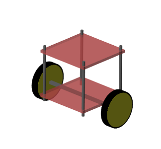
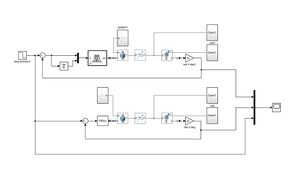

# EFLL-Balancing-Robot
Project of Two-wheel Self-balancing robot with fuzzy logic control using embedded fuzzy logic library (eFLL).<br>
`fuzzy-logic`、`eFLL`、`Self-Balancing robot`

## Problem to Solve
1. Two-wheel self-balancing robot design for works.
2. Fuzzy logic control system design and testing.
3. Compare the `Fuzzy Logic` control with `PID` control, which is most used on two-wheel self-balancing robot control.

## Material
### Overall
* Arduino nano
* L298N / H-Bridge → DC Motor Driver Module
* 3-6v TT DC Motor
* Isolation Column, Acrylic Sheet and Wheel / Gear sets

### MPU6050
`MPU6050` is a multifunction sensor, and we could basically get the pose data like acceleration and angular velocity from it. Two bytes of following 14 bytes from register `0x3B` to `0x48` are one data of sensors. These include a three-axis accelerometer and gyroscope, respectively; and one temperature sensor. The raw data could communicate with Arduino through `I2C` protocol.
```c
Wire.beginTransmission(address);
Wire.write(0x3B); 
// Starting from register 0x3B -> ACCEL_XOUT_H
Wire.endTransmission(false);
Wire.requestFrom(address, 14, true);
accx = (Wire.read() << 8 | Wire.read());
accy = (Wire.read() << 8 | Wire.read());
accz = (Wire.read() << 8 | Wire.read());
// FS_SEL = 0, Full Scale Range = -/+ 250 degree/s
// RAW_DATA * FULL_SCALE_RANGE / 32768.0 -> Gravity Values
temp = (Wire.read() << 8 | Wire.read());
gyrx = (Wire.read() << 8 | Wire.read());
gyry = (Wire.read() << 8 | Wire.read());
gyrz = (Wire.read() << 8 | Wire.read());
// AFS_SEL = 0, Full Scale Range = -/+ 2g
// RAW_DATA * FULL_SCALE_RANGE / 32768.0 -> Gravity Values
```

### [eFLL](https://github.com/alvesoaj/eFLL)
Arduino cannot execute Python scripts on their chip independently except through serial port and modules, so there is no way to use `Scikit-Fuzzy` module on Arduino to implement our fuzzy control system. Therefore, we went to use a library base on C/C++ call `eFLL` (Embedded Fuzzy Logic Library) that allows us compile and execute our fuzzy logic control system on the Arduino Nano.

## Methods
### Signal Process
Once we got the raw data from the MPU6050, due to affect by gravitational acceleration or some shaking, unnecessary high-frequency noise is generated, which is not conducive to the use of the controller. So before passing into the controller, the input signal should be adjusted and smoothed by sensor fusion. Complementary filter and Kalman filter are two common types of sensor fusion.

***Complementary Filter***<br>
Complementary filter is basically managing both `high-pass` and `low-path` filter simultaneously. The low pass filter filters high frequency signals (such as the accelerometer in the case of vibration) and low pass filters that filter low frequency signals (such as the drift of the gyroscope). By combining these filters, once could got a proper data.

```cpp
float Complementary::update_(float acc_Angle, float gyro_Rate){
    pre_time = current_time; 
    current_time = millis(); 
    time_step = (current_time - pre_time) / 1000;
    current_angle = alpha * (gyro_Rate * time_step + pre_angle) + (1 - alpha) * acc_Angle;
    pre_angle = current_angle;
    return current_angle;
}
```

***Kalman Filter*** <br>
 In a nut shell, Kalman filter `estimate` and `update` the measurement at the same time. It judges the reliability of the measurement value by the error value of the estimated value and the variation of the measurement value.

 ```cpp
double Kalman::update_(double new_value, double new_rate){
    dt = (double)(micros() - t) / 1e6;
    K_Rate = new_rate - K_Bias;
    K_Angle += K_Rate * dt;

    p[0][0] += (p[1][1] + p[0][1]+ Q_Angle ) * dt;
    p[0][1] -= p[1][1] * dt;
    p[1][0] -= p[1][1] * dt;
    p[1][1] += Q_Bias * dt;
    s = p[0][0] + R_Measure;
    k[0] = p[0][0] / s;
    k[1] = p[1][0] / s;

    y = new_value - K_Angle;
    K_Angle += k[0] * y;
    K_Bias += k[1] * y;

    p[0][0] -= k[0] * p[0][0];
    p[0][1] -= k[0] * p[0][1];
    p[1][0] -= k[1] * p[0][0];
    p[1][1] -= k[1] * p[0][1];

    t = (double)micros();
    return K_Angle;
}
 ```
 <br>
 The figure below shown the comparison and the effect of smoothing of each filter. The accelerator and gyroscope have been calibration first before the test. We choose the Kalman filter finally, due to the shift error effect of gyroscope of complementary filter. We think that error could be a key instance of stability. <br><br>

 

### Fuzzy Logic System
In the fuzzy logic system, we could convert a crisp input into a linguistic variable, and through the `IF-THEN` rule to get the corresponding outputs. In our fuzzy logic control system, we think two to three membership function is needed for the basic balancing robot. That is, `N` and `P` represent the negative and positive situation for the robot’s pose, if needed, `Z` represent no error situation. <br><br>




Once the angle pose is negative for the robot, and the angular velocity is negative too (mean tend to tilt to negative position), then the controller would output a positive PWM signal to the DC motor to drag back the cart to the balancing position. In another ways, if the robot is tilt to positive angle instead, the angular velocity is negative, then we could hope it could back to balancing itself. The degree of judge the position, rate and signal is depended by the shape of each membership function.

There are some of membership function I try as followings. Our membership function might be too simple that, the degree of negative could be `slight` or `serve`, so on positive. Thus, we could robust our membership function for the fuzzy logic control system to adjust the pose of the robot immediately. <br><br>






Besides, Embedded Fuzzy Logic Library could only generate `triangular` and `trapezoidal` membership function, and it might limits the controller. Thus, maybe configure the membership function with nonlinear function like `Gaussian`, leading to a better performance.

### MATLAB Simulink
Simply design a two-wheel robot and tell the simulation backend the `mass`, `inertia` and basic `damping factor` of the robot cart. And also give it the joint of the cart, like the shaft of the wheel and the cart’ connect which could manage a sensor of angular change for the simulation.
<br><br>



